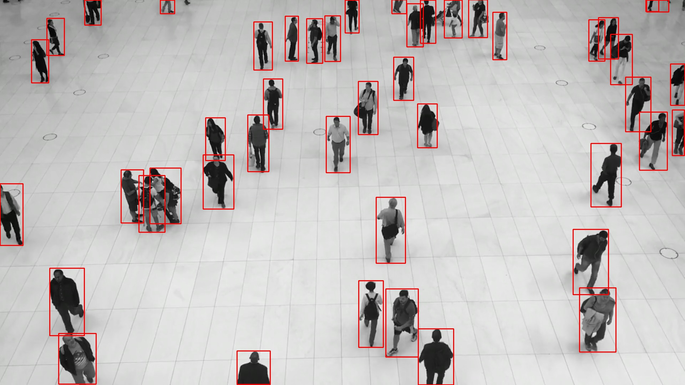

# Yolov7-TensorRT

## Build

```bash
cd build
cmake ..
make -j$(nproc)
```

## Convert pytorch weight to onnx

```bash
cd <yolov7-pytorch>
python export.py --weights ./yolov7.pt --grid --simplify --img-size 640 640
```

## Convert onnx to Tensorrt

```bash
cd build/TrtExec
./TrtExec-bin \
    --onnx ./weights/yolov7.onnx \
    --engine ./weights/yolov7.engine \
    --inputName "images" \
    --minShape 1x3x640x640 \
    --optShape 1x3x640x640 \
    --maxShape 1x3x640x640 \
    --workspace 1024
```

# Result

